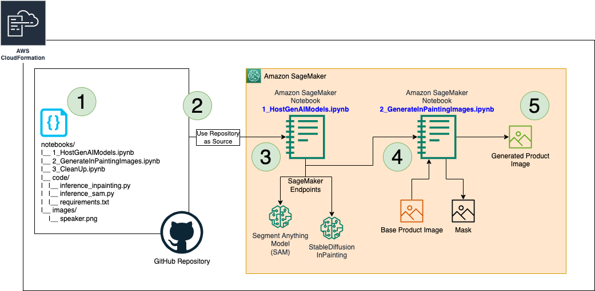
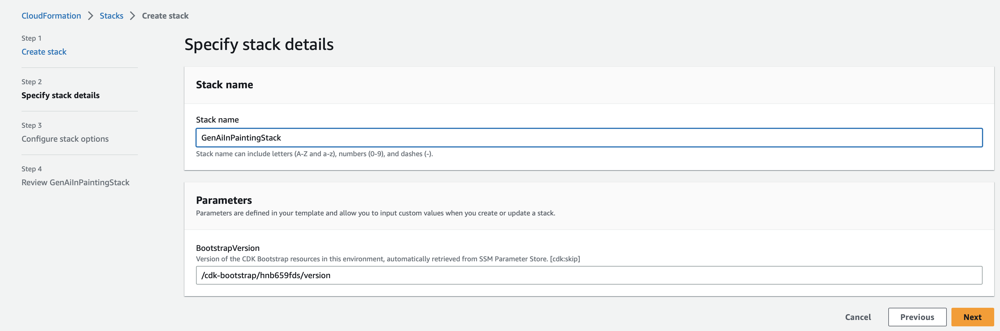
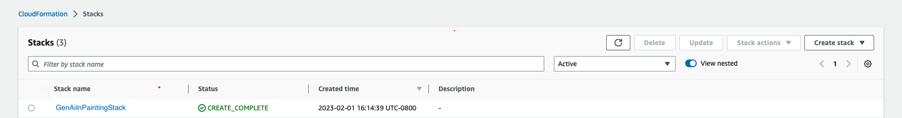

# Using Generative AI InPainting for Product Placement
This project is a practical demonstration of utilizing Amazon SageMaker to run an inpainting algorithm. This repository serves as a starting point for developers interested in leveraging SageMaker's capabilities for image completion tasks. Inpainting, a powerful technique in computer vision, enables the automatic filling in of missing or corrupted parts of an image using machine learning algorithms. By providing a simple and streamlined implementation, this repository offers a hands-on experience for understanding how to set up and run an inpainting model on the SageMaker platform. By leveraging the potential of inpainting, we aim to revolutionize the way products are integrated into visual content, enabling advertisers and marketers to seamlessly incorporate their offerings in a visually appealing and contextually relevant manner.
In this demo, we are using SageMaker endpoints to host the Generative AI models and pass images to create outputs.

The project utilizes [AWS CloudFormation/CDK](https://aws.amazon.com/cloudformation/) to build the stack and once that is created, it uses the SageMaker notebooks created in order to run the Generative AI tasks.

Note: Although this repository is released under the `MIT-0` license, its `StableDiffusionInPaintPipeline`
use the third party `diffusers` project. The `diffusers` project's licensing includes the `OpenRAIL-M` license.

## AWS Architecture:


## AWS CloudFormation Stack Creation
The AWS CloudFormation Stack can be created using 2 methods: (1) Using Template or (2) Using AWS CDK. Both the methods are described as follows:

1. Create Stack using AWS CloudFormation:
    - Choose **Launch Stack** and (if prompted) log into your AWS account:
    [](https://console.aws.amazon.com/cloudformation/home#/stacks/create/review?templateURL=https://raw.githubusercontent.com/aws-samples/sagemaker-generative-ai-for-product-placement-using-images/main/gai-inpainting-cdk/gai-inpainting-cfn-template.yaml?token=GHSAT0AAAAAACBIXJAIMBNLB3CAMETIB75CZDYB7MA)
    - Select a unique Stack Name, ackowledge creation of IAM resources, create the stack and wait for a few minutes for it to be successfully deployed
        1. 
        2. 
        3. 

2. Generative AI InPainting using AWS CDK
In order to create the stack with AWS CDK, follow the steps highlighted in [gai-inpainting-cdk](gai-inpainting-cdk/README.md). Use these steps:
```
$ cd gai-inpainting-cdk
$ python3 -m venv .venv
$ source .venv/bin/activate
$ pip3 install -r requirements.txt
$ cdk synth
$ cdk bootstrap
$ cdk deploy
```

## Running InPainting using Amazon SageMaker notebooks:
- From AWS Console, go to [Amazon SageMaker Notebook Instances](https://us-east-1.console.aws.amazon.com/sagemaker/home?region=us-east-1#/notebook-instances)
- Select the Notebook created by the stack and open it
- Inside SageMaker Notebook, navigate: `notebooks` and open the notebooks: `1_HostGenAIModels.ipynb`, `2_GenerateInPaintingImages.ipynb` & `3_CleanUp.ipynb`
    1. `1_HostGenAIModels.ipynb`: Host the 2 models (SAM and InPainting) to SageMaker Endpoint.
    2. `2_GenerateInPaintingImages.ipynb`: Using prompts, the base image and the mask generated, run in-painting model to generate an output image.
    3. `3_CleanUp.ipynb`: Run a cleanup job to destroy the endpoints.

## Contributors:
- [Fabian Benitez-Quiroz (@fabianbq)](fabianbq@amazon.com)
- [Romil Shah (@rpshah)](rpshah@amazon.com)
